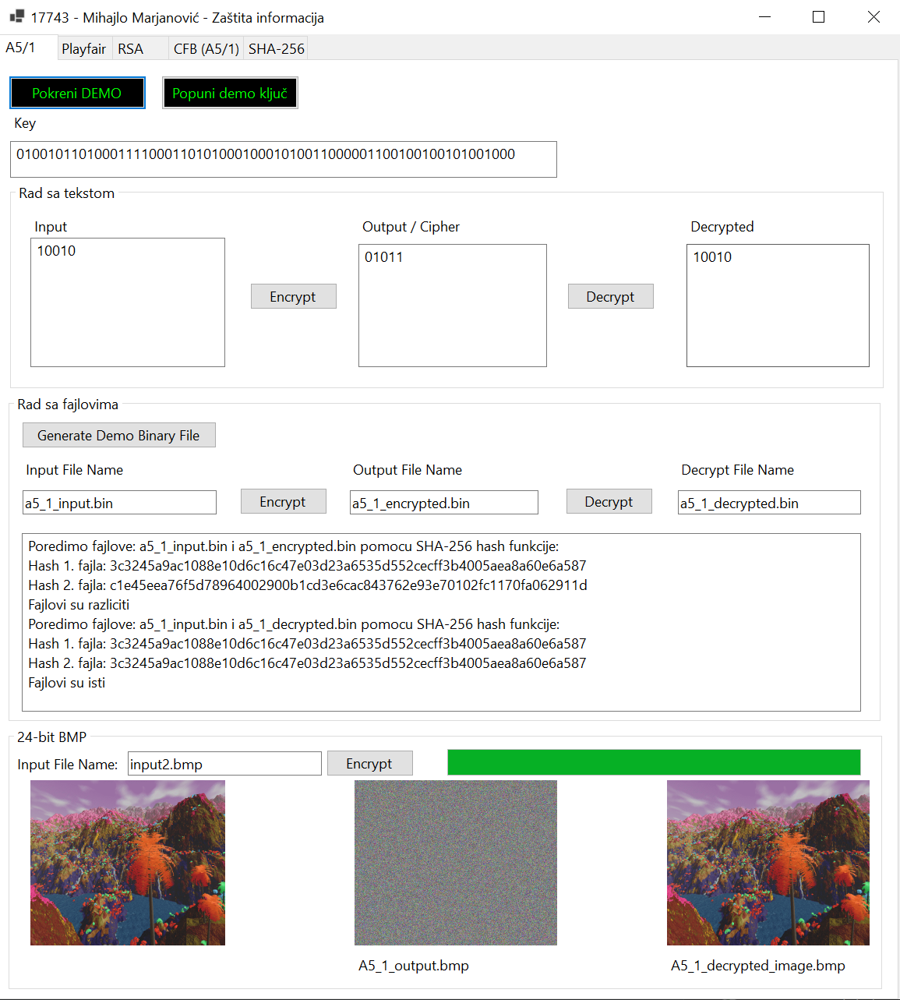

# Data protection - CS project

## [Mihajlo - Portfolio](https://www.mihajlo.tech)

Projekat je rađen u C#-u - WinForms
Implementirane su sve funkcionalnosti tražene u zadatku:
- Sve 4 cipher klase iz 4. grupe
- Fajlovi - input/output rade sa svim klasama
- SHA-256 hash - posebna klasa
- 24-bit BMP u A5/1 klasi
- Paralelizacija u Playfair klasi

Svaki tab u UI-u odgovara jednoj klasi.
Svaki tab poseduje DEMO dugme koje pokreće demonstraciju
mogućnosti te klase.
Priloženi su primeri fajlova korišćeni prilikom testiranja.
Za 24-bit BMP priložene su i 2 BMP slike input.bmp i input2.bmp, input.bmp (skroz plava slika) se koristi podrazumevano zbog brzine demonstracije.
Fajlovi će biti generisani i čitani iz root foldera:
./bin/Debug/net6.0-windows/imeFajla

17743 - Mihajlo Marjanović

